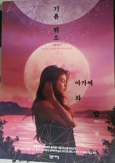

# 아가씨와 밤 [혹시모를 스포주의]
## 기욤 뮈소

처음 읽기 시작했을 때는 '스릴러? 정말?' 이라는 생각이 들었다. 어쩌면 나에게는 생소한 프랑스식 이름들이 주는 어색함 탓에 입에서 발음을 굴려보느라 스산한 분위기를 느끼지 못했던 걸지도 모른다. 한참 빠져들면서 읽기 시작했을 때 나는 주인공이 동창생들이 모두 모인 자리에서 그들과 과거에도 현재에도 어울리지 못하면서도 그들의 과거를 모두 떠올리고 있다는걸 깨달았다. 조금씩 느껴지는 주인공의 불안함에 동조하기 시작한지 얼마되지 않아 주인공은 친구와 과거의 살인이 완벽하게 은폐되지 않고 드러날 위기에 처했다는 것에 대해 고민하기 시작했고, 비로소 나는 이 소설이 사건의 비밀을 풀어나가는 탐정 소설이 아닌 스릴러임을 다시 한번 상기했다. 

시작부터 이 소설은 주인공의 하루에 대한 이야기였다. 그 하루에는 세명의 주인공이 있다. 다 잊고 평범하게 살고 싶었던 주인공과, 절대 잊을 수 없는 주인공과, 아무것도 알지 못했던 주인공이 있었다.
