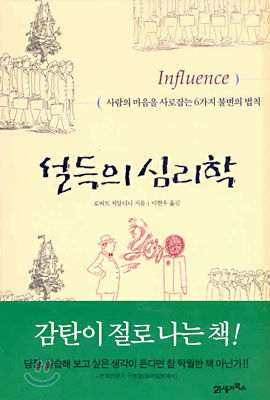

# 설득의 심리학 
## 로버트 치알디니

이 책으로부터 무언가를 배워서, 그걸 실제로 어딘가에 써먹어보겠다는 큰 포부를 가지고 책을 선택한건 아니다. 다만 제목에서부터 이끌렸고, 읽어두면 언젠가 도움이 되지 않을까 싶어서 고른건 사실이다.
그런데 이 책은 실제로 누군가를 설득하기 위한 방법을 알려주는 책이 아니라, 어떤 현상이 벌어졌을 때 그 현상에 대한 이해를 심리학적으로 설명하는 책이었다. 즉, 그 현상을 어떻게 이용할 것인가는 전혀 다른 문제였다.
조금은 당혹스러웠지만, 그래도 생각해볼만한 점들이 많아 재밌게 읽고있다.

많이 팔아서 많이 남기기 위해 품질에 비해 조금 싼 가격에 팔던 보석이 오히려 잘 팔리지 않다가, 실수로 높은 가격에 팔때는 불티나게 팔렸다. 보석에 대해 잘 알지 못하는 관광객들이, 오히려 높은 가격을 보고 "높은 가격=좋은 품질" 이라는 고정관념에 사기 시작한 것이다.
그런데 만약, 처음부터 보석에 대해 잘 알지 못하는 관광객이 아니라, 적당한 품질의 상품을 싸게 구매하고 적당한 가격에 판매하여 차익으로 이익을 챙기는 재테크에 익숙한 사람들이 그 보석들을 보고있었다면 어땠을까?
그 사람들은 오히려 비싼 금액의 보석은 거들떠보지도 않았을까? 혹시 보석의 가격보다는 "품질대비 가격"에 집중해서 오히려 더 자세히 살펴보지 않았을까? (물론 그랬다면 실수로 높은 가격에 파는 보석을 살리는 없겠지만.)

결국 "고정관념이 의사결정에 가장 강력하게 영향을 미치니 그걸 이용하자!" 는게 아니라, 그 "고정관념 밖에 적용할 수 없도록 만드는 것"이 중요하다. 위에서의 예처럼, 재테크에 익숙한 사람들은 오히려 고정관념을 떨쳐내고 더 자세히 살펴보고 분석한 후에 의사결정을 내릴 것이다.
왜 그 차이가 벌어질까? 단순히 보석에 대해 모르는 관광객은 바보같아서? 그보다는 얻을 수 있는 정보와 시간이 한정적이기 때문에 가장 빠르게 의사결정을 내릴 수 있는 근거인 고정관념을 사용했기 때문일 것이다. 이 책에서는 이러한 현상에 대해 설명하지만, 더 나아가서 이걸 누군가를 설득하거나 다른 방향으로 활용하기 위해서는 반드시 이걸 명심해야 한다.
고정관념을 이용하는게 아니라, 고정관념을 이용할 수 밖에 없도록 해야한다. 터키석이 2배의 가격으로 팔리는게 아니라, 적당한 가격에 한정된 수량을 정해진 시간에 판매하도록 했다면 어떨까?

그리고 그게 바로 내가 마트 마감시간에 구매한 마감세일 상품들의 총액이 항상 목표금액보다 큰 이유란 걸 깨달았다.
